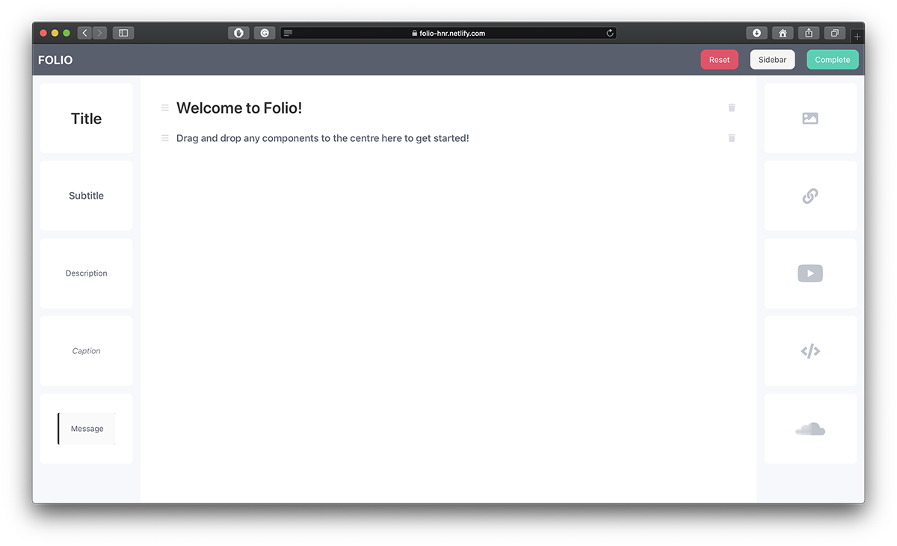
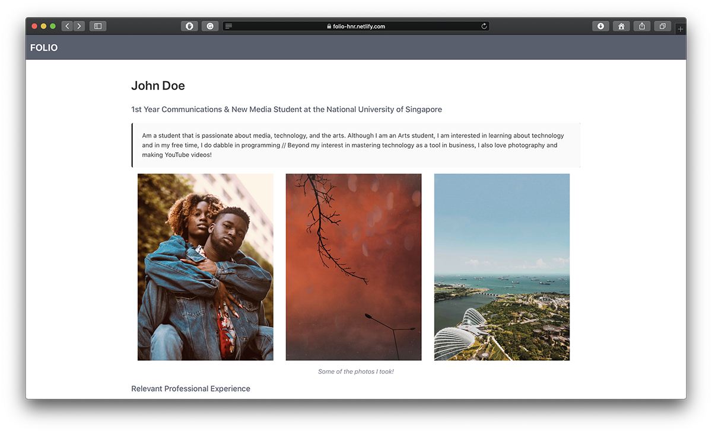

<h1 align="center">Folio</h1>
<p align="center"><em>A Seamless Drag and Drop Portfolio Building Experience</em></p>

<p align="center"></p>

Folio is a portfolio builder that helps you to craft a simple yet beautiful portfolio in minutes, through a seamless drag and drop experience. Save your work and immediately get a shareable link to your online portfolio.

Folio was built over a course of 24 hours for the hackathon [Hack&Roll 2020](https://hacknroll.nushackers.org). The team members are:
* [Zhu Hanming](https://www.github.com/zhuhanming)
* [Liu Jia Rui](https://github.com/charoi)
* [Praveen Elango](https://github.com/PraveenElango)
* [Nicholas Toh](https://github.com/nicktohzyu)

The core packages/dependencies used are:
* [react-beautiful-dnd](https://www.github.com/atlassian/react-beautiful-dnd)
* [redux](https://github.com/reduxjs/redux), [react-redux](https://github.com/reduxjs/react-redux), [redux-persist](https://github.com/rt2zz/redux-persist), [redux-toolkit](https://github.com/reduxjs/redux-toolkit)
* [Bulma](https://bulma.io) for the styling

Other packages used for both production and development can be found in [package.json](package.json).

The code for the backend can be found [here](https://github.com/zhuhanming/hacknroll-backend).

This project was bootstrapped with [Create React App](https://github.com/facebook/create-react-app).<br/><br/>
[](https://app.netlify.com/sites/folio-hnr/deploys)

## Features

With Folio, you can instantly add the following elements to your portfolio:
* Title
* Subtitle
* Description
* Caption
* Message
* Images (up to 3 in a row, automatically resizes)
* URLs
* YouTube Videos
* Code Samples
* SoundCloud Embed

Simply drag and drop it into the middle. It's that easy!

## Project Structure
```bash
folio
├── public/
└── src/
    │   index.js
    │   serviceWorker.js
    ├── app/
    ├── assets/
    ├── components/
    ├── constants/
    ├── contexts/
    ├── reducers/
    ├── routes/
    ├── services/
    └── utils/
```

## Available Scripts

In the project directory, you can run:

### `yarn start`

Runs the app in the development mode.<br />
Open [http://localhost:3000](http://localhost:3000) to view it in the browser.

The page will reload if you make edits.<br />
You will also see any lint errors in the console.

### `yarn test`

Launches the test runner in the interactive watch mode.<br />
See the section about [running tests](https://facebook.github.io/create-react-app/docs/running-tests) for more information.

### `yarn build`

Builds the app for production to the `build` folder.<br />
It correctly bundles React in production mode and optimizes the build for the best performance.

The build is minified and the filenames include the hashes.<br />
Your app is ready to be deployed!

See the section about [deployment](https://facebook.github.io/create-react-app/docs/deployment) for more information.

### `yarn eject`

**Note: this is a one-way operation. Once you `eject`, you can’t go back!**

If you aren’t satisfied with the build tool and configuration choices, you can `eject` at any time. This command will remove the single build dependency from your project.

Instead, it will copy all the configuration files and the transitive dependencies (Webpack, Babel, ESLint, etc) right into your project so you have full control over them. All of the commands except `eject` will still work, but they will point to the copied scripts so you can tweak them. At this point you’re on your own.

You don’t have to ever use `eject`. The curated feature set is suitable for small and middle deployments, and you shouldn’t feel obligated to use this feature. However we understand that this tool wouldn’t be useful if you couldn’t customize it when you are ready for it.
